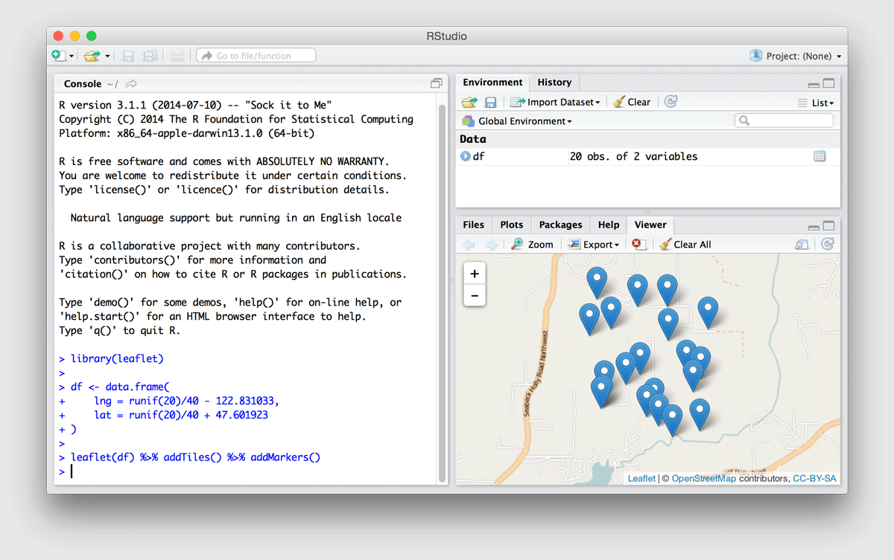
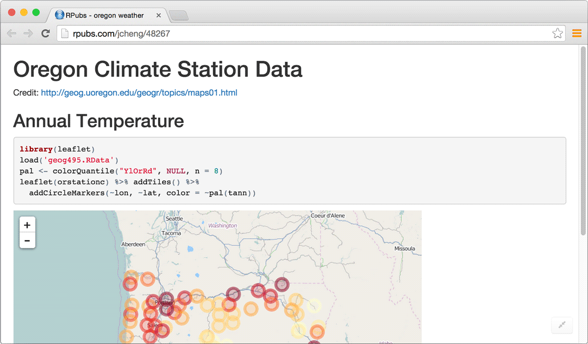
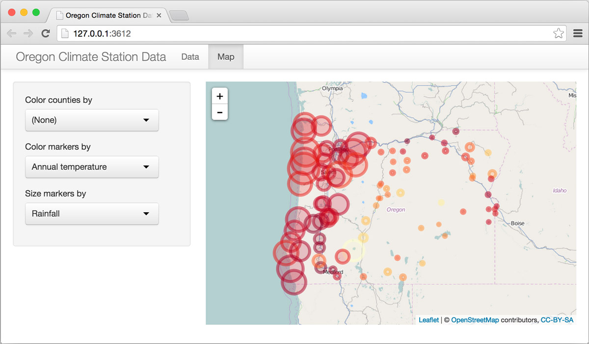
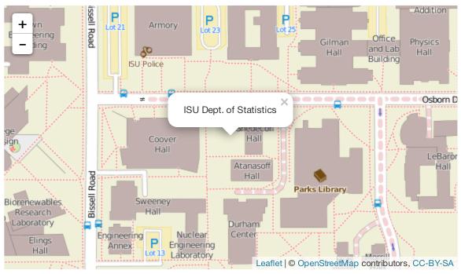
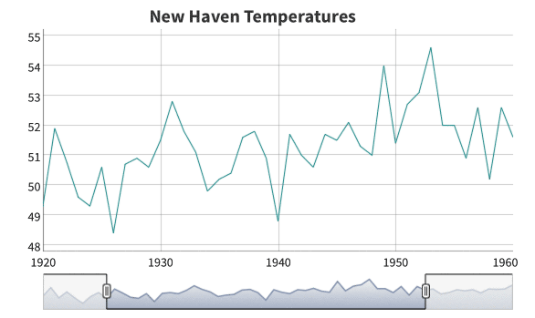
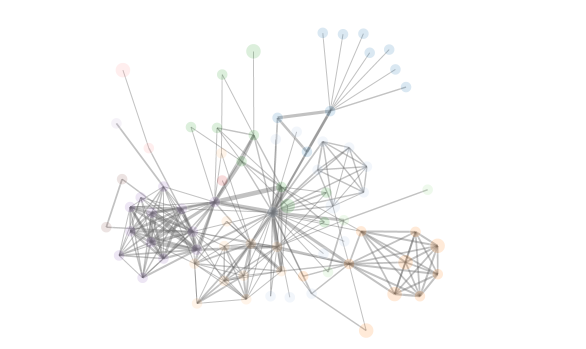
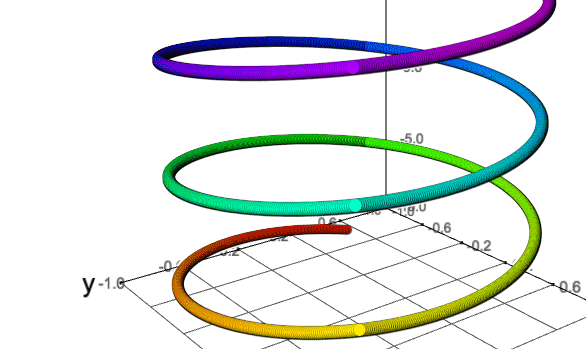

<!--html_preserve-->

 <!--page-body-->

 <!--container-fluid main-container-->

  

    

      

        
&nbsp;

        <h4>Bring the best of JavaScript data visualization to R</h4>
        <ul>
          <li>Use JavaScript visualization libraries <strong>at the R console</strong>, just like plots</li>
          <li>Embed widgets in <strong>R Markdown</strong> documents and <strong>Shiny</strong> web applications</li>
          <li><strong>Develop new widgets</strong> using a framework that seamlessly bridges R and JavaScript</li>
        </ul>
      

      

        

          <!-- Indicators -->
          <ol class="carousel-indicators hide">
            <li data-target="#widget-carousel" data-slide-to="0" class="active"></li>
            <li data-target="#widget-carousel" data-slide-to="1"></li>
            <li data-target="#widget-carousel" data-slide-to="2"></li>
          </ol>

          <!-- Wrapper for slides -->
          

            

              
              

              

            

            

              
              

              

            

            

              
              

              

            

          

          <!-- Controls -->
          <!--
          <a class="left carousel-control" href="#widget-carousel" role="button" data-slide="prev">
            
            Previous
          </a>
          <a class="right carousel-control" href="#widget-carousel" role="button" data-slide="next">
            
            Next
          </a>
          -->
        

        <ul class="pagination pagination-sm">
          <li class="active"><a href="javascript:void" data-target="#widget-carousel" data-slide-to="0">At the R console</a></li>
          <li><a href="javascript:void" data-target="#widget-carousel" data-slide-to="1">In R Markdown docs</a></li>
          <li><a href="javascript:void" data-target="#widget-carousel" data-slide-to="2">In Shiny apps</a></li>
        </ul>

      

    
 <!-- row -->
  
 <!-- container-fluid main-container -->

 <!-- jumbotron -->

  <h3>Widgets in action</h3>
  

    

      

        

          
        

        

          
        

        

          
        

        

          
        

      

    

  

  

    

      
See how just a line or two of R code can be used to create interactive visualizations with Leafet (mapping), Dygraphs (time-series), networkD3 (graph visualization), and more.

    

    

      
<a class="btn btn-info" href="showcase_leaflet.html" role="button">See the showcase &raquo;</a>

    

  

  

  <h3>Creating widgets</h3>
  

    

      
Learn how to create an R binding for your favorite JavaScript library and enable use of it in the R console, in R Markdown documents, and in Shiny web applications.

    

    

      
<a class="btn btn-success" href="develop_intro.html" role="button">Develop a widget &raquo;</a>

    

  

<!--/html_preserve-->
