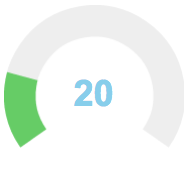
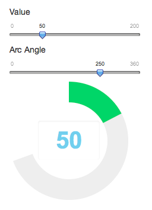

<!---
TODO:
  - Debug shiny sizing issues
  - Sizing vignette
  - Advanced vignette
  - Update images in vignettes
-->

### Introduction to HTML Widgets

`htmlwidgets` is a framework for creating HTML widgets that render in various contexts including the R console, [R Markdown](http://rmarkdown.rstudio.com) documents, and [Shiny](http://shiny.rstudio.com) web applications. Widgets can include arbitrary HTML and JavaScript and are an ideal way to bridge the gap between R and JavaScript data visualization libraries. 

Some examples of packages that use `htmlwidgets` are:

* [dygraphs](http://rstudio.github.io/dygraphs/) --- Interactive time series visualization
* [networkD3](http://christophergandrud.github.io/networkD3/) --- Network visualization with D3
* [sparkline](https://github.com/htmlwidgets/sparkline) --- Small inline charts
* [DT](http://rstudio.github.io/DT/) --- Tabular data via DataTables
* [rthreejs](https://github.com/bwlewis/rthreejs) -- Interactive 3D graphics

### Widget Basics

The philosophy of the `htmlwidgets` package is convention over configuration. By following a small set of easy-to-follow conventions, it is possible to create HTML widgets with very little code. All widgets include the following components:

1. **Dependencies**. These are the JavaScript and CSS assets used by the widget (e.g. the library you are creating a wrapper for).

3. **R Binding**. This is the function that end users will call to provide input data to the widget as well as specify various options for how the widget should render. This also includes some short boilerplate functions required to use the widget within Shiny applications.

3. **JavaScript Binding**. This is the JavaScript code that glues everything together, passing the data and options gathered in the R binding to the underlying JavaScript library.

HTML widgets are always hosted within an R package and must include all of the source code for their dependencies. This is to ensure that code which depends on widgets is fully reproducible (i.e. doesn't require an internet connection or the ongoing availability of an internet service to run).

Below we'll walk through an example widget that wraps the [jQuery Knob](http://anthonyterrien.com/knob/) library.

#### File Layout

Let's assume that our widget is named `knob` and is located within an R package of the same name. Here are the files that we'll add to the package:

```
R/
| knob.R

inst/
|-- htmlwidgets/
|   |-- knob.js
|   |-- knob.yaml
|   |-- lib/
|   |   |-- jquery/
|   |   |   |-- dist/
|   |   |   |   |-- jquery.min.js
|   |   |-- knob/
|   |   |   |-- dist/
|   |   |   |   |-- jquery.knob.min.js
```

Note the convention that the JavaScript, YAML, and other dependencies are all contained within the `inst/htmlwidgets` directory.

#### Dependencies

Dependencies are the JavaScript and CSS assets used by a widget. Dependencies are included within the `inst/htmlwidgets/lib` directory. Dependencies are specified using a YAML configuration file which uses the name of the widget as it's base file name. Here's what our **knob.yaml** file looks like:

```yaml
dependencies:
  - name: jquery
    version: 2.1.1
    src: "htmlwidgets/lib/jquery"
    script: jquery.min.js
  - name: knob
    version: 1.0.1
    src: "htmlwidgets/lib/knob"
    script: jquery.knob.min.js
```

Note that `src` refers to the directory that contains the library and `script` refrers to a specific JavaScript file. You can also add `stylesheet` entries and even `meta` or `head` entries. See the documentation on the `htmlDependency` function in the [**htmltools**](http://cran.r-project.org/web/packages/htmltools/index.html) package for additional details.

#### R Binding

We need to provide users with an R function that invokes our widget. Typically this function will accept input data as well as various options that control the widget's display. Here's the R function for `knob`:

```r
knob <- function(value, min, max, width = NULL, height = NULL) {
  
  x <- list()
  x$value <- value
  x$min <- min
  x$max <- max
  
  htmlwidgets::createWidget('knob', x, width = width, height = height)
}
```

Here we collect all of the values required by knob into a list named `x` and then pass that to the `createWidget` function (the `x` variable will be subsequently be made available within our JavaScript binding). Any width or height parameter specified is also forwarded to the widget (widgets size themselves automatically by default so typically don't require an explicit width or height).

We want our knob component to also work in Shiny applications, so we add the following boilerplate Shiny output and render functions (these are always the same for all widgets):

```r
knobOutput <- function(outputId, width = "100%", height = "400px") {
  shinyWidgetOutput(outputId, "knob", width, height, package = "knob")
}
renderKnob <- function(expr, env = parent.frame(), quoted = FALSE) {
  if (!quoted) { expr <- substitute(expr) } # force quoted
  shinyRenderWidget(expr, knobOutput, env, quoted = TRUE)
}
```

#### JavaScript Binding

The third piece in the puzzle is the JavaScript required to activate the widget. By convention we'll define our JavaScript binding in the file `inst/htmlwidgets/knob.js`. Here is the binding:

```javascript
HTMLWidgets.widget({

  name: "knob",
  
  type: "output",
  
  initialize: function(el) {
    $(el).knob({
      readOnly: true
    });
  },
  
  renderValue: function(el, x) {
    $(el).trigger("configure", x);
    $(el).val(x.value).trigger("change");
  }
});
```

We provide a name and type for the widget and then implement two functions:

1) The `initialize` function creates and/or attaches to DOM elements as required. In this case we call `knob` on our element to let the knob library know we want to attach it's behavior to the element. We pass the `readOnly` flag because the knob is being used only to display values rather than accept input.

2) The `renderValue` function actually pours our dynamic data (the `x` value from the R binding) into the widget. Here we apply options, set the value, and trigger the change event.

#### Demo

These three components are the core of implementing any widget. There are a couple of other subtleties to the implementation which we'll cover below, but before getting to that let's give the widget a test drive. You can install it from GitHub as follows:

```r
install_github(c('ramnathv/htmlwidgets', 'jjallaire/knob'))
```

Let us first create a simple knob:

```r
library(knob)
knob(value = 20, min = 0, max = 100)
```



If you execute this code in the R console you'll see the widget displayed in the RStudio Viewer (or in an external browser if you aren't running RStudio). If you include it within an R Markdown document the widget will be embedded into the document.

We can also use the widget in a Shiny application:

```r
library(shiny)
library(knob)

ui = shinyUI(fluidPage(
  sliderInput('value', 'Value', min = 0, max = 200, value = 50),
  knobOutput('gauge')
))

server = function(input, output) {
  output$gauge <- renderKnob(
    knob(value = input$value, min = 0, max = 200)
  )
}

shinyApp(ui = ui, server = server)
```



### Finishing Touches

To keep the initial presentation focused on the essentials we didn't include all of the code required to build the knob widget above. Here we cover the rest of what's required.

#### Widget HTML

Typically the HTML "housing" for a widget is just a `<div>` element, and this is correspondingly the default behavior for new widgets that don't specify otherwise. Since the knob widget uses an `<input>` element rather than a `<div>`, we write an R function `knob_html` which  provides us with the correct element type:

```r
knob_html <- function(name, id, style, class, ...){
  htmltools::tags$input(type = "text", class = class, id = id)
}
```

Note that this function is looked up within the package implementing the widget by the convention `widgetname_html` so it need not be formally exported from your package or otherwise registered with **htmlwidgets**.

Most widgets won't need a custom HTML function but if you need to generate custom HTML for your widget (e.g. you need an `<input>` or a `<span>` rather than a `<div>`) then you should use the **htmltools** package (as demonstrated by the code above).

#### Widget Sizing

HTML widgets can be rendered in a wide variety of contexts and can be resized at any time so they need a way to deal with these concerns. The htmlwidgets framework includes some tools to help:

1) Widgets can pass a `sizingPolicy` as part of the `createWidget` call which dictates how they want to be sized in various contexts (browser, viewer, knitr, etc.).

2) Widgets can implement a `resize` method on the JavaScript side to forward sizing behavior on to the underlying JavaScript libary.

In the case of the **knob** widget, the default sizing policy works fine (i.e. treat the widget like an R plot) however dynamic sizing requires a custom `resize` method. You can see the details of the resize implementation in the [Sizing](sizing.Rmd) vignette.

#### Additional Options

In our initial implementation we exposed only a subset of the options available for jQuery knob. Adding more options is simply a matter of adding parameters to our `knob` R function and including them in the `x` object that is ultimately passed to the `renderValue` function. Here's what our function looks like with some additonal options:

```r
knob <- function(value, min, max, step = 1, 
                 angleOffset = 0, angleArc = 360,
                 font = NULL, fgColor = NULL, bgColor = NULL,
                 width = NULL, height = NULL) {
  
  x <- list()
  x$value <- value
  x$min <- min
  x$max <- max
  x$step <- step
  x$angleOffset <- angleOffset
  x$angleArc <- angleArc
  x$font <- font
  x$fgColor <- fgColor
  x$bgColor <- bgColor
  
  htmlwidgets::createWidget('knob', x, width = width, height = height)
}
```

Note that it would also be possible to add a `...` parameter to forward arbitrary additional options to the knob. For libraries that have a large surface area this may be a good idea, but it's helpful in general to provide as many options directly reflected in R parameters so that users can learn how to use your widget without needing to consult the documentation for the underlying JavaScript library.

### Creating Your Own Widgets

#### Scaffolding

When you want to create your own widget you can call the `scaffoldWidget` function to create the basic structure for your widget. This function will:

* Create the .R, .js, and .yaml files required for your widget;

* If provided, take a [Bower](http://bower.io/) package name and automatically download the JavaScript library (and it's dependencies) and add the required entries to the .yaml file.

This method is highly recommended as it ensures that you get started with the right structure. Here's how it works:

1) First create an R package to house your widget

2) Next, change to the working directory of your package and execute the following:

```r
> htmlwidgets::scaffoldWidget("mywidget") # add optional bower pkg name if appropriate
```

Build the package and you'll have a simple working widget (that doesn't do anything yet). For this example you could invoke your widget at the R console as follows:

```r
> mywidget()
```

Note that it has no parameters yet. Next you should study the API of the JavaScript library you are wrapping and map it as appropriate into the R and JavaScript bindings.

#### Learning from Examples

Get started by studying the code of the simple example above and applying it to the widget that you are building. You may also want to study the code of other packages to learn about specific things relevant to your widget:

1. The [networkD3](https://github.com/christophergandrud/networkD3) package illustrates creating a widget on top of [D3](http://d3js.org), using a custom sizing policy for a larger widget, and providing multiple widgets from a single package.

2. The [dygraphs](https://github.com/rstudio/dygraphs/) package illustrates using widget instance data, handling dynamic resizing, and using [magrittr](https://github.com/smbache/magrittr) to decompose a large and flat JavaScript API into a more modular and pipeable R API.

3. The [sparkline](https://github.com/htmlwidgets/sparkline) package illustrates  providing a custom HTML generation function (since sparklines must be housed in `<span>` rather than `<div>` elements).
 


